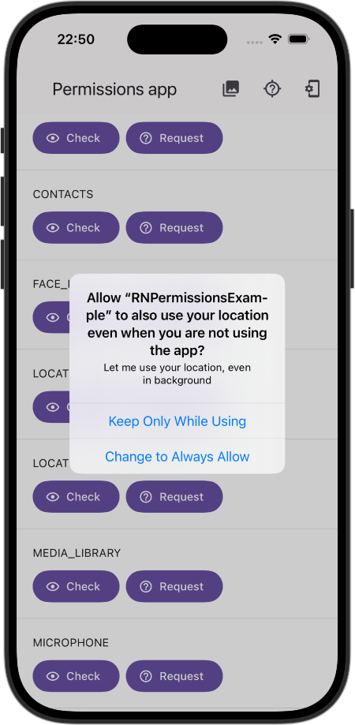
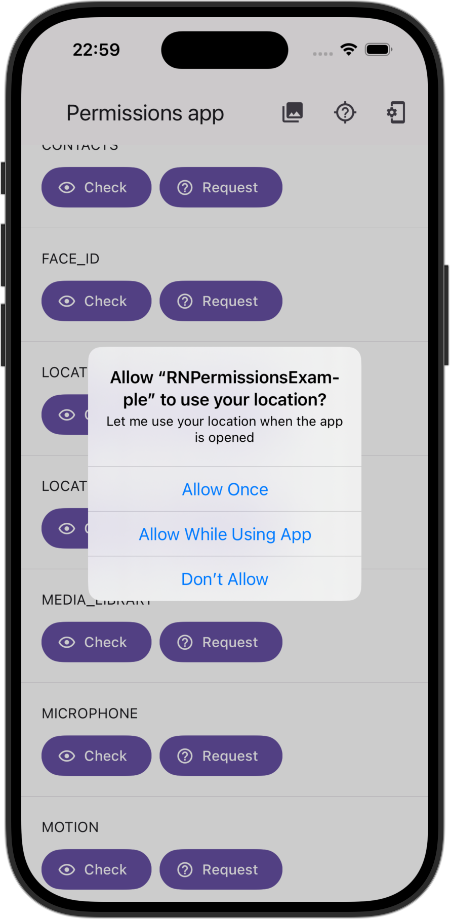
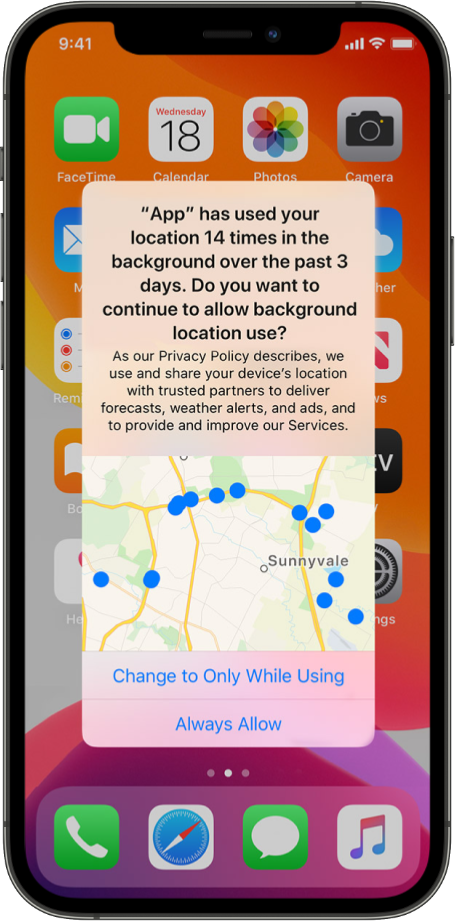

# ☝🏼 react-native-permissions

An unified permissions API for React Native on iOS, Android and Windows.<br>
(For Windows only builds 18362 and later are supported)

[](https://github.com/zoontek/react-native-permissions/blob/main/LICENSE)
[](https://www.npmjs.org/package/react-native-permissions)
[](https://www.npmjs.org/package/react-native-permissions)
<br />
[](https://www.android.com)
[](https://developer.apple.com/ios)
[](https://www.microsoft.com/en-us/windows)

## Support

This library follows the React Native [releases support policy](https://github.com/reactwg/react-native-releases/blob/main/docs/support.md).<br>
It is supporting the **latest version**, and the **two previous minor series**.

## Setup

```bash
$ npm i -S react-native-permissions
# --- or ---
$ yarn add react-native-permissions
```

### iOS

1. By default, no permissions are available. First, require the `setup` script in your `Podfile`:

```diff
# Transform this into a `node_require` generic function:
- # Resolve react_native_pods.rb with node to allow for hoisting
- require Pod::Executable.execute_command('node', ['-p',
-   'require.resolve(
-     "react-native/scripts/react_native_pods.rb",
-     {paths: [process.argv[1]]},
-   )', __dir__]).strip

+ def node_require(script)
+   # Resolve script with node to allow for hoisting
+   require Pod::Executable.execute_command('node', ['-p',
+     "require.resolve(
+       '#{script}',
+       {paths: [process.argv[1]]},
+     )", __dir__]).strip
+ end

# Use it to require both react-native's and this package's scripts:
+ node_require('react-native/scripts/react_native_pods.rb')
+ node_require('react-native-permissions/scripts/setup.rb')
```

2. In the same `Podfile`, call `setup_permissions` with the permissions you need. Only the permissions specified here will be added:

```ruby
# …

platform :ios, min_ios_version_supported
prepare_react_native_project!

# ⬇️ uncomment the permissions you need
setup_permissions([
  # 'AppTrackingTransparency',
  # 'Bluetooth',
  # 'Calendars',
  # 'CalendarsWriteOnly',
  # 'Camera',
  # 'Contacts',
  # 'FaceID',
  # 'LocationAccuracy',
  # 'LocationAlways',
  # 'LocationWhenInUse',
  # 'MediaLibrary',
  # 'Microphone',
  # 'Motion',
  # 'Notifications',
  # 'PhotoLibrary',
  # 'PhotoLibraryAddOnly',
  # 'Reminders',
  # 'Siri',
  # 'SpeechRecognition',
  # 'StoreKit',
])

# …
```

3. Then execute `pod install` in your `ios` directory _(📌  Note that it must be re-executed each time you update this config)_.
4. Finally, add the corresponding permissions usage descriptions to your `Info.plist`. For example:

```xml
<?xml version="1.0" encoding="UTF-8"?>
<!DOCTYPE plist PUBLIC "-//Apple//DTD PLIST 1.0//EN" "http://www.apple.com/DTDs/PropertyList-1.0.dtd">
<plist version="1.0">
<dict>

  <!-- 🚨 Keep only the permissions specified in `setup_permissions` 🚨 -->

  <key>NSAppleMusicUsageDescription</key>
  <string>[REASON]</string>
  <key>NSBluetoothAlwaysUsageDescription</key>
  <string>[REASON]</string>
  <key>NSBluetoothPeripheralUsageDescription</key>
  <string>[REASON]</string>
  <key>NSCalendarsFullAccessUsageDescription</key>
  <string>[REASON]</string>
  <key>NSCalendarsWriteOnlyAccessUsageDescription</key>
  <string>[REASON]</string>
  <key>NSCameraUsageDescription</key>
  <string>[REASON]</string>
  <key>NSContactsUsageDescription</key>
  <string>[REASON]</string>
  <key>NSFaceIDUsageDescription</key>
  <string>[REASON]</string>
  <key>NSLocationAlwaysAndWhenInUseUsageDescription</key>
  <string>[REASON]</string>
  <key>NSLocationTemporaryUsageDescriptionDictionary</key>
  <dict>
    <key>YOUR-PURPOSE-KEY</key>
    <string>[REASON]</string>
  </dict>
  <key>NSLocationWhenInUseUsageDescription</key>
  <string>[REASON]</string>
  <key>NSMicrophoneUsageDescription</key>
  <string>[REASON]</string>
  <key>NSMotionUsageDescription</key>
  <string>[REASON]</string>
  <key>NSPhotoLibraryUsageDescription</key>
  <string>[REASON]</string>
  <key>NSPhotoLibraryAddUsageDescription</key>
  <string>[REASON]</string>
  <key>NSRemindersFullAccessUsageDescription</key>
  <string>[REASON]</string>
  <key>NSSpeechRecognitionUsageDescription</key>
  <string>[REASON]</string>
  <key>NSSiriUsageDescription</key>
  <string>[REASON]</string>
  <key>NSUserTrackingUsageDescription</key>
  <string>[REASON]</string>

  <!-- … -->

</dict>
</plist>
```

### Android

Add all wanted permissions to your app `android/app/src/main/AndroidManifest.xml` file:

```xml
<manifest xmlns:android="http://schemas.android.com/apk/res/android">

  <!-- 🚨 Keep only the permissions used in your app 🚨 -->

  <uses-permission android:name="android.permission.ACCEPT_HANDOVER" />
  <uses-permission android:name="android.permission.ACCESS_BACKGROUND_LOCATION" />
  <uses-permission android:name="android.permission.ACCESS_COARSE_LOCATION" />
  <uses-permission android:name="android.permission.ACCESS_FINE_LOCATION" />
  <uses-permission android:name="android.permission.ACCESS_MEDIA_LOCATION" />
  <uses-permission android:name="android.permission.ACTIVITY_RECOGNITION" />
  <uses-permission android:name="com.android.voicemail.permission.ADD_VOICEMAIL" />
  <uses-permission android:name="android.permission.ANSWER_PHONE_CALLS" />
  <uses-permission android:name="android.permission.BLUETOOTH_ADVERTISE" />
  <uses-permission android:name="android.permission.BLUETOOTH_CONNECT" />
  <uses-permission android:name="android.permission.BLUETOOTH_SCAN" />
  <uses-permission android:name="android.permission.BODY_SENSORS" />
  <uses-permission android:name="android.permission.BODY_SENSORS_BACKGROUND" />
  <uses-permission android:name="android.permission.CALL_PHONE" />
  <uses-permission android:name="android.permission.CAMERA" />
  <uses-permission android:name="android.permission.GET_ACCOUNTS" />
  <uses-permission android:name="android.permission.NEARBY_WIFI_DEVICES" />
  <uses-permission android:name="android.permission.POST_NOTIFICATIONS" />
  <uses-permission android:name="android.permission.PROCESS_OUTGOING_CALLS" />
  <uses-permission android:name="android.permission.READ_CALENDAR" />
  <uses-permission android:name="android.permission.READ_CALL_LOG" />
  <uses-permission android:name="android.permission.READ_CONTACTS" />
  <uses-permission android:name="android.permission.READ_EXTERNAL_STORAGE" />
  <uses-permission android:name="android.permission.READ_MEDIA_AUDIO" />
  <uses-permission android:name="android.permission.READ_MEDIA_IMAGES" />
  <uses-permission android:name="android.permission.READ_MEDIA_VIDEO" />
  <uses-permission android:name="android.permission.READ_MEDIA_VISUAL_USER_SELECTED" />
  <uses-permission android:name="android.permission.READ_PHONE_NUMBERS" />
  <uses-permission android:name="android.permission.READ_PHONE_STATE" />
  <uses-permission android:name="android.permission.READ_SMS" />
  <uses-permission android:name="android.permission.RECEIVE_MMS" />
  <uses-permission android:name="android.permission.RECEIVE_SMS" />
  <uses-permission android:name="android.permission.RECEIVE_WAP_PUSH" />
  <uses-permission android:name="android.permission.RECORD_AUDIO" />
  <uses-permission android:name="android.permission.SCHEDULE_EXACT_ALARM" />
  <uses-permission android:name="android.permission.SEND_SMS" />
  <uses-permission android:name="android.permission.USE_SIP" />
  <uses-permission android:name="android.permission.UWB_RANGING" />
  <uses-permission android:name="android.permission.WRITE_CALENDAR" />
  <uses-permission android:name="android.permission.WRITE_CALL_LOG" />
  <uses-permission android:name="android.permission.WRITE_CONTACTS" />
  <uses-permission android:name="android.permission.WRITE_EXTERNAL_STORAGE" />

  <!-- … -->

</manifest>
```

### Expo

If you use Expo, the previous sections don't apply. Instead just update your `app.json` file with the corresponding values, but using the syntax exemplified below:

```js
{
  "expo": {
    "name": "Awesome app",
    "plugins": [
      [
        "react-native-permissions",
        {
          // Add setup_permissions to your Podfile (see iOS setup - steps 1, 2 and 3)
          "iosPermissions": [
            "Camera",
            "Microphone"
          ]
        }
      ]
    ],
    "ios": {
      // Add descriptions to your Info.plist (see iOS setup - step 4)
      "infoPlist": {
        "NSCameraUsageDescription": "[REASON]",
        "NSMicrophoneUsageDescription": "[REASON]"
      }
    },
    "android": {
      // Add permissions to your AndroidManifest.xml (see Android setup)
      "permissions": [
        "android.permission.CAMERA",
        "android.permission.RECORD_AUDIO"
      ]
    }
  }
}
```

### Windows

Open the project solution file from the `windows` folder. In the app project open `Package.appxmanifest` file. From there you can select which capabilites you want your app to support.

## 🆘 Manual linking

Because this package targets recent React Native versions, you probably don't need to link it manually. But if you have a special case, follow these additional instructions:

<details>
  <summary><b>👀 See manual linking instructions</b></summary>

### iOS

Add this line to your `ios/Podfile` file, then run `pod install`.

```bash
target 'YourAwesomeProject' do
  # …
  pod 'RNPermissions', :path => '../node_modules/react-native-permissions'
end
```

### Android

1. Add the following lines to `android/settings.gradle`:

```gradle
include ':react-native-permissions'
project(':react-native-permissions').projectDir = new File(rootProject.projectDir, '../node_modules/react-native-permissions/android')
```

2. Add the implementation line to the dependencies in `android/app/build.gradle`:

```gradle
dependencies {
  // ...
  implementation project(':react-native-permissions')
}
```

3. Add the import and link the package in `MainApplication.java`:

```java
import com.zoontek.rnpermissions.RNPermissionsPackage; // <- add the RNPermissionsPackage import

public class MainApplication extends Application implements ReactApplication {

  // …

  @Override
  protected List<ReactPackage> getPackages() {
    @SuppressWarnings("UnnecessaryLocalVariable")
    List<ReactPackage> packages = new PackageList(this).getPackages();
    // …
    packages.add(new RNPermissionsPackage());
    return packages;
  }

  // …
}
```

### Windows

1. In `windows/myapp.sln` add the `RNCConfig` project to your solution:

- Open the solution in Visual Studio 2019
- Right-click Solution icon in Solution Explorer > Add > Existing Project
- Select `node_modules\react-native-permissions\windows\RNPermissions\RNPermissions.vcxproj`

2. In `windows/myapp/myapp.vcxproj` ad a reference to `RNPermissions` to your main application project. From Visual Studio 2019:

- Right-click main application project > Add > Reference...
- Check `RNPermissions` from Solution Projects.

3. In `pch.h` add `#include "winrt/RNPermissions.h"`.

4. In `app.cpp` add `PackageProviders().Append(winrt::RNPermissions::ReactPackageProvider());` before `InitializeComponent();`.

</details>

## Understanding permission flow

As permissions are not handled in the same way on iOS, Android and Windows, this library provides an abstraction over the three platforms behaviors. To understand it a little better, take a look to this flowchart:

```
 ┏━━━━━━━━━━━━━━━━━━━━━━━━┓
 ┃ check(PERMISSIONS.X.Y) ┃
 ┗━━━━━━━━━━━━━━━━━━━━━━━━┛
              │                                ┌─────────────────────┐
  Is the feature available ───────── NO ─────▶ │ RESULTS.UNAVAILABLE │
      on this device ?                         └─────────────────────┘
              │
             YES
              │                                ┌───────────────────────────┐
      Is the permission ─────────── YES ─────▶ │ RESULTS.GRANTED / LIMITED │
      already granted ?                        └───────────────────────────┘
              │
              NO
              │                                ┌─────────────────┐
Is the permission requestable, ───── NO ─────▶ │ RESULTS.BLOCKED │
 or is the platform Android ?                  └─────────────────┘
              │
             YES
              │
              ▼
     ┌────────────────┐
     │ RESULTS.DENIED │
     └────────────────┘
              │
              ▼
 ┏━━━━━━━━━━━━━━━━━━━━━━━━━━┓
 ┃ request(PERMISSIONS.X.Y) ┃◀─────────────────────────┐
 ┗━━━━━━━━━━━━━━━━━━━━━━━━━━┛                          │
              │                                       YES
              │                                        │
    Did the user see and ──────── NO ──────── Is the permission
    accept the request ?                      still requestable ?
              │                                        │
             YES                                       NO
              │                                        │
              ▼                                        ▼
┌───────────────────────────┐                 ┌─────────────────┐
│ RESULTS.GRANTED / LIMITED │                 │ RESULTS.BLOCKED │
└───────────────────────────┘                 └─────────────────┘
```

This can be implemented as follows:

- `check` the permission status
- If `granted`, use the feature
- If `blocked`, display a screen prompting the user to go to settings (using `openSettings`) _(This will not be shown on Android)_
- If `denied`, display a button to `request` permission:
  - If `granted`, use the feature
  - If `blocked`, display an alert prompting the user to go to settings (using `openSettings`)

The user experience (UX) is excellent on iOS and acceptable on Android, considering the platform's limitations.

## API

### Supported permissions

<details>
  <summary><b>Android permissions</b></summary>

```js
import {PERMISSIONS} from 'react-native-permissions';

PERMISSIONS.ANDROID.ACCEPT_HANDOVER;
PERMISSIONS.ANDROID.ACCESS_BACKGROUND_LOCATION;
PERMISSIONS.ANDROID.ACCESS_COARSE_LOCATION;
PERMISSIONS.ANDROID.ACCESS_FINE_LOCATION;
PERMISSIONS.ANDROID.ACCESS_MEDIA_LOCATION;
PERMISSIONS.ANDROID.ACTIVITY_RECOGNITION;
PERMISSIONS.ANDROID.ADD_VOICEMAIL;
PERMISSIONS.ANDROID.ANSWER_PHONE_CALLS;
PERMISSIONS.ANDROID.BLUETOOTH_ADVERTISE;
PERMISSIONS.ANDROID.BLUETOOTH_CONNECT;
PERMISSIONS.ANDROID.BLUETOOTH_SCAN;
PERMISSIONS.ANDROID.BODY_SENSORS;
PERMISSIONS.ANDROID.BODY_SENSORS_BACKGROUND;
PERMISSIONS.ANDROID.CALL_PHONE;
PERMISSIONS.ANDROID.CAMERA;
PERMISSIONS.ANDROID.GET_ACCOUNTS;
PERMISSIONS.ANDROID.NEARBY_WIFI_DEVICES;
PERMISSIONS.ANDROID.POST_NOTIFICATIONS;
PERMISSIONS.ANDROID.PROCESS_OUTGOING_CALLS;
PERMISSIONS.ANDROID.READ_CALENDAR;
PERMISSIONS.ANDROID.READ_CALL_LOG;
PERMISSIONS.ANDROID.READ_CONTACTS;
PERMISSIONS.ANDROID.READ_EXTERNAL_STORAGE;
PERMISSIONS.ANDROID.READ_MEDIA_AUDIO;
PERMISSIONS.ANDROID.READ_MEDIA_IMAGES;
PERMISSIONS.ANDROID.READ_MEDIA_VIDEO;
PERMISSIONS.ANDROID.READ_MEDIA_VISUAL_USER_SELECTED;
PERMISSIONS.ANDROID.READ_PHONE_NUMBERS;
PERMISSIONS.ANDROID.READ_PHONE_STATE;
PERMISSIONS.ANDROID.READ_SMS;
PERMISSIONS.ANDROID.RECEIVE_MMS;
PERMISSIONS.ANDROID.RECEIVE_SMS;
PERMISSIONS.ANDROID.RECEIVE_WAP_PUSH;
PERMISSIONS.ANDROID.RECORD_AUDIO;
PERMISSIONS.ANDROID.SEND_SMS;
PERMISSIONS.ANDROID.USE_SIP;
PERMISSIONS.ANDROID.UWB_RANGING;
PERMISSIONS.ANDROID.WRITE_CALENDAR;
PERMISSIONS.ANDROID.WRITE_CALL_LOG;
PERMISSIONS.ANDROID.WRITE_CONTACTS;
PERMISSIONS.ANDROID.WRITE_EXTERNAL_STORAGE;
```

</details>

<details>
  <summary><b>iOS permissions</b></summary>

```js
import {PERMISSIONS} from 'react-native-permissions';

PERMISSIONS.IOS.APP_TRACKING_TRANSPARENCY;
PERMISSIONS.IOS.BLUETOOTH;
PERMISSIONS.IOS.CALENDARS;
PERMISSIONS.IOS.CALENDARS_WRITE_ONLY;
PERMISSIONS.IOS.CAMERA;
PERMISSIONS.IOS.CONTACTS;
PERMISSIONS.IOS.FACE_ID;
PERMISSIONS.IOS.LOCATION_ALWAYS;
PERMISSIONS.IOS.LOCATION_WHEN_IN_USE;
PERMISSIONS.IOS.MEDIA_LIBRARY;
PERMISSIONS.IOS.MICROPHONE;
PERMISSIONS.IOS.MOTION;
PERMISSIONS.IOS.PHOTO_LIBRARY;
PERMISSIONS.IOS.PHOTO_LIBRARY_ADD_ONLY;
PERMISSIONS.IOS.REMINDERS;
PERMISSIONS.IOS.SIRI;
PERMISSIONS.IOS.SPEECH_RECOGNITION;
PERMISSIONS.IOS.STOREKIT;
```

</details>

<details>
  <summary><b>Windows permissions</b></summary>

```js
import {PERMISSIONS} from 'react-native-permissions';

PERMISSIONS.WINDOWS.ACCESSORY_MANAGER;
PERMISSIONS.WINDOWS.ACTIVITY;
PERMISSIONS.WINDOWS.ALLOW_ELEVATION;
PERMISSIONS.WINDOWS.ALL_APP_MODS;
PERMISSIONS.WINDOWS.ALL_JOYN;
PERMISSIONS.WINDOWS.APPOINTMENTS;
PERMISSIONS.WINDOWS.APPOINTMENTS_SYSTEM;
PERMISSIONS.WINDOWS.APP_BROADCAST_SERVICES;
PERMISSIONS.WINDOWS.APP_CAPTURE_SERVICES;
PERMISSIONS.WINDOWS.APP_CAPTURE_SETTINGS;
PERMISSIONS.WINDOWS.APP_DIAGNOSTICS;
PERMISSIONS.WINDOWS.APP_LICENSING;
PERMISSIONS.WINDOWS.AUDIO_DEVICE_CONFIGURATION;
PERMISSIONS.WINDOWS.BACKGROUND_MEDIA_PLAYBACK;
PERMISSIONS.WINDOWS.BACKGROUND_MEDIA_RECORDING;
PERMISSIONS.WINDOWS.BACKGROUND_SPATIAL_PERCEPTION;
PERMISSIONS.WINDOWS.BACKGROUND_VOIP;
PERMISSIONS.WINDOWS.BLOCKED_CHAT_MESSAGES;
PERMISSIONS.WINDOWS.BLUETOOTH;
PERMISSIONS.WINDOWS.BROAD_FILE_SYSTEM_ACCESS;
PERMISSIONS.WINDOWS.CAMERA_PROCESSING_EXTENSION;
PERMISSIONS.WINDOWS.CELLULAR_DEVICE_CONTROL;
PERMISSIONS.WINDOWS.CELLULAR_DEVICE_IDENTITY;
PERMISSIONS.WINDOWS.CELLULAR_MESSAGING;
PERMISSIONS.WINDOWS.CHAT_SYSTEM;
PERMISSIONS.WINDOWS.CODE_GENERATION;
PERMISSIONS.WINDOWS.CONFIRM_APP_CLOSE;
PERMISSIONS.WINDOWS.CONTACTS;
PERMISSIONS.WINDOWS.CONTACTS_SYSTEM;
PERMISSIONS.WINDOWS.CORTANA_PERMISSIONS;
PERMISSIONS.WINDOWS.CORTANA_SPEECH_ACCESSORY;
PERMISSIONS.WINDOWS.CUSTOM_INSTALL_ACTIONS;
PERMISSIONS.WINDOWS.DEVELOPMENT_MODE_NETWORK;
PERMISSIONS.WINDOWS.DEVICE_MANAGEMENT_DM_ACCOUNT;
PERMISSIONS.WINDOWS.DEVICE_MANAGEMENT_EMAIL_ACCOUNT;
PERMISSIONS.WINDOWS.DEVICE_MANAGEMENT_FOUNDATION;
PERMISSIONS.WINDOWS.DEVICE_MANAGEMENT_WAP_SECURITY_POLICIES;
PERMISSIONS.WINDOWS.DEVICE_PORTAL_PROVIDER;
PERMISSIONS.WINDOWS.DEVICE_UNLOCK;
PERMISSIONS.WINDOWS.DOCUMENTS_LIBRARY;
PERMISSIONS.WINDOWS.DUAL_SIM_TILES;
PERMISSIONS.WINDOWS.EMAIL;
PERMISSIONS.WINDOWS.EMAIL_SYSTEM;
PERMISSIONS.WINDOWS.ENTERPRISE_AUTHENTICATION;
PERMISSIONS.WINDOWS.ENTERPRISE_CLOUD_S_S_O;
PERMISSIONS.WINDOWS.ENTERPRISE_DATA_POLICY;
PERMISSIONS.WINDOWS.ENTERPRISE_DEVICE_LOCKDOWN;
PERMISSIONS.WINDOWS.EXPANDED_RESOURCES;
PERMISSIONS.WINDOWS.EXTENDED_BACKGROUND_TASK_TIME;
PERMISSIONS.WINDOWS.EXTENDED_EXECUTION_BACKGROUND_AUDIO;
PERMISSIONS.WINDOWS.EXTENDED_EXECUTION_CRITICAL;
PERMISSIONS.WINDOWS.EXTENDED_EXECUTION_UNCONSTRAINED;
PERMISSIONS.WINDOWS.FIRST_SIGN_IN_SETTINGS;
PERMISSIONS.WINDOWS.GAME_BAR_SERVICES;
PERMISSIONS.WINDOWS.GAME_LIST;
PERMISSIONS.WINDOWS.GAME_MONITOR;
PERMISSIONS.WINDOWS.GAZE_INPUT;
PERMISSIONS.WINDOWS.GLOBAL_MEDIA_CONTROL;
PERMISSIONS.WINDOWS.HUMANINTERFACEDEVICE;
PERMISSIONS.WINDOWS.INPUT_FOREGROUND_OBSERVATION;
PERMISSIONS.WINDOWS.INPUT_INJECTION_BROKERED;
PERMISSIONS.WINDOWS.INPUT_OBSERVATION;
PERMISSIONS.WINDOWS.INPUT_SUPPRESSION;
PERMISSIONS.WINDOWS.INTERNET_CLIENT;
PERMISSIONS.WINDOWS.INTERNET_CLIENT_SERVER;
PERMISSIONS.WINDOWS.INTEROP_SERVICES;
PERMISSIONS.WINDOWS.IOT;
PERMISSIONS.WINDOWS.LOCAL_SYSTEM_SERVICES;
PERMISSIONS.WINDOWS.LOCATION;
PERMISSIONS.WINDOWS.LOCATION_HISTORY;
PERMISSIONS.WINDOWS.LOCATION_SYSTEM;
PERMISSIONS.WINDOWS.LOW_LEVEL;
PERMISSIONS.WINDOWS.LOW_LEVEL_DEVICES;
PERMISSIONS.WINDOWS.MICROPHONE;
PERMISSIONS.WINDOWS.MOBILE;
PERMISSIONS.WINDOWS.MODIFIABLE_APP;
PERMISSIONS.WINDOWS.MUSIC_LIBRARY;
PERMISSIONS.WINDOWS.NETWORKING_VPN_PROVIDER;
PERMISSIONS.WINDOWS.NETWORK_CONNECTION_MANAGER_PROVISIONING;
PERMISSIONS.WINDOWS.NETWORK_DATA_PLAN_PROVISIONING;
PERMISSIONS.WINDOWS.NETWORK_DATA_USAGE_MANAGEMENT;
PERMISSIONS.WINDOWS.OEM_DEPLOYMENT;
PERMISSIONS.WINDOWS.OEM_PUBLIC_DIRECTORY;
PERMISSIONS.WINDOWS.ONE_PROCESS_VOIP;
PERMISSIONS.WINDOWS.OPTICAL;
PERMISSIONS.WINDOWS.PACKAGED_SERVICES;
PERMISSIONS.WINDOWS.PACKAGES_SERVICES;
PERMISSIONS.WINDOWS.PACKAGE_MANAGEMENT;
PERMISSIONS.WINDOWS.PACKAGE_POLICY_SYSTEM;
PERMISSIONS.WINDOWS.PACKAGE_QUERY;
PERMISSIONS.WINDOWS.PACKAGE_WRITE_REDIRECTION_COMPATIBILITY_SHIM;
PERMISSIONS.WINDOWS.PHONE_CALL;
PERMISSIONS.WINDOWS.PHONE_CALL_HISTORY;
PERMISSIONS.WINDOWS.PHONE_CALL_HISTORY_SYSTEM;
PERMISSIONS.WINDOWS.PHONE_LINE_TRANSPORT_MANAGEMENT;
PERMISSIONS.WINDOWS.PICTURES_LIBRARY;
PERMISSIONS.WINDOWS.POINT_OF_SERVICE;
PERMISSIONS.WINDOWS.PREVIEW_INK_WORKSPACE;
PERMISSIONS.WINDOWS.PREVIEW_PEN_WORKSPACE;
PERMISSIONS.WINDOWS.PREVIEW_STORE;
PERMISSIONS.WINDOWS.PREVIEW_UI_COMPOSITION;
PERMISSIONS.WINDOWS.PRIVATE_NETWORK_CLIENT_SERVER;
PERMISSIONS.WINDOWS.PROTECTED_APP;
PERMISSIONS.WINDOWS.PROXIMITY;
PERMISSIONS.WINDOWS.RADIOS;
PERMISSIONS.WINDOWS.RECORDED_CALLS_FOLDER;
PERMISSIONS.WINDOWS.REMOTE_PASSPORT_AUTHENTICATION;
PERMISSIONS.WINDOWS.REMOTE_SYSTEM;
PERMISSIONS.WINDOWS.REMOVABLE_STORAGE;
PERMISSIONS.WINDOWS.RESCAP;
PERMISSIONS.WINDOWS.RUN_FULL_TRUST;
PERMISSIONS.WINDOWS.SCREEN_DUPLICATION;
PERMISSIONS.WINDOWS.SECONDARY_AUTHENTICATION_FACTOR;
PERMISSIONS.WINDOWS.SECURE_ASSESSMENT;
PERMISSIONS.WINDOWS.SERIALCOMMUNICATION;
PERMISSIONS.WINDOWS.SHARED_USER_CERTIFICATES;
PERMISSIONS.WINDOWS.SLAPI_QUERY_LICENSE_VALUE;
PERMISSIONS.WINDOWS.SMBIOS;
PERMISSIONS.WINDOWS.SMS_SEND;
PERMISSIONS.WINDOWS.SPATIAL_PERCEPTION;
PERMISSIONS.WINDOWS.START_SCREEN_MANAGEMENT;
PERMISSIONS.WINDOWS.STORE_LICENSE_MANAGEMENT;
PERMISSIONS.WINDOWS.SYSTEM_MANAGEMENT;
PERMISSIONS.WINDOWS.TARGETED_CONTENT;
PERMISSIONS.WINDOWS.TEAM_EDITION_DEVICE_CREDENTIAL;
PERMISSIONS.WINDOWS.TEAM_EDITION_EXPERIENCE;
PERMISSIONS.WINDOWS.TEAM_EDITION_VIEW;
PERMISSIONS.WINDOWS.UAP;
PERMISSIONS.WINDOWS.UI_AUTOMATION;
PERMISSIONS.WINDOWS.UNVIRTUALIZED_RESOURCES;
PERMISSIONS.WINDOWS.USB;
PERMISSIONS.WINDOWS.USER_ACCOUNT_INFORMATION;
PERMISSIONS.WINDOWS.USER_DATA_ACCOUNTS_PROVIDER;
PERMISSIONS.WINDOWS.USER_DATA_SYSTEM;
PERMISSIONS.WINDOWS.USER_PRINCIPAL_NAME;
PERMISSIONS.WINDOWS.USER_SYSTEM_ID;
PERMISSIONS.WINDOWS.VIDEOS_LIBRARY;
PERMISSIONS.WINDOWS.VOIP_CALL;
PERMISSIONS.WINDOWS.WALLET_SYSTEM;
PERMISSIONS.WINDOWS.WEBCAM;
PERMISSIONS.WINDOWS.WIFI_CONTROL;
PERMISSIONS.WINDOWS.XBOX_ACCESSORY_MANAGEMENT;
```

</details>

### Permissions statuses

Permission checks and requests resolve into one of these statuses:

| Return value          | Notes                                                                                                                                  |
| --------------------- | -------------------------------------------------------------------------------------------------------------------------------------- |
| `RESULTS.UNAVAILABLE` | This feature is not available (on this device / in this context)                                                                       |
| `RESULTS.DENIED`      | The permission has not been requested / is denied but requestable                                                                      |
| `RESULTS.BLOCKED`     | The permission is denied and not requestable                                                                                           |
| `RESULTS.GRANTED`     | The permission is granted                                                                                                              |
| `RESULTS.LIMITED`     | The permission is granted but with limitations<br>_Only for iOS `Contacts`, `PhotoLibrary`, `PhotoLibraryAddOnly` and `Notifications`_ |

### Types

```ts
type ValueOf<T> = T[keyof T];

type Permission =
  | ValueOf<typeof PERMISSIONS.ANDROID>
  | ValueOf<typeof PERMISSIONS.IOS>
  | ValueOf<typeof PERMISSIONS.WINDOWS>;

type PermissionStatus = ValueOf<typeof RESULTS>;

type RationaleObject = {
  title: string;
  message: string;
  buttonPositive: string;
  buttonNegative?: string;
};

type Rationale = RationaleObject | (() => Promise<boolean>);

type NotificationOption =
  | 'alert'
  | 'badge'
  | 'sound'
  | 'carPlay'
  | 'criticalAlert'
  | 'provisional'
  | 'providesAppSettings';

type NotificationSettings = {
  // unavailable settings will not be included in the response object
  alert?: boolean;
  badge?: boolean;
  sound?: boolean;
  carPlay?: boolean;
  criticalAlert?: boolean;
  provisional?: boolean;
  providesAppSettings?: boolean;
  lockScreen?: boolean;
  notificationCenter?: boolean;
};

type NotificationsResponse = {
  status: PermissionStatus;
  settings: NotificationSettings;
};

type LocationAccuracy = 'full' | 'reduced';
type LocationAccuracyOptions = {purposeKey: string};
```

### Methods

#### check

Check one permission status.

> [!IMPORTANT]  
> On Android, the `check` function will never return a `blocked` status. You need to call `request` to obtain that information.

```ts
function check(permission: Permission): Promise<PermissionStatus>;
```

```ts
check(PERMISSIONS.IOS.CAMERA).then((status) => {
  switch (status) {
    case RESULTS.UNAVAILABLE:
      return console.log('This feature is not available (on this device / in this context)');
    case RESULTS.DENIED:
      return console.log('The permission has not been requested / is denied but requestable');
    case RESULTS.BLOCKED:
      return console.log('The permission is denied and not requestable');
    case RESULTS.GRANTED:
      return console.log('The permission is granted');
    case RESULTS.LIMITED:
      return console.log('The permission is granted but with limitations');
  }
});
```

#### request

Request one permission.

The `rationale` is only available and used on Android. It can be a native alert (a `RationaleObject`) or a custom implementation (that resolves with a `boolean`).

```ts
function request(permission: Permission, rationale?: Rationale): Promise<PermissionStatus>;
```

```ts
import {request, PERMISSIONS} from 'react-native-permissions';

request(PERMISSIONS.IOS.CAMERA).then((status) => {
  // …
});
```

#### checkNotifications

Check notifications permission status and get notifications settings values.

> [!IMPORTANT]  
> On Android 13+, the `checkNotifications` function will never return a `blocked` status. You need to call `requestNotifications` to obtain that information.

```ts
function checkNotifications(): Promise<NotificationsResponse>;
```

```ts
import {checkNotifications} from 'react-native-permissions';

checkNotifications().then(({status, settings}) => {
  // …
});
```

#### requestNotifications

Request notifications permission status and get notifications settings values.

- You have to [target at least SDK 33](https://github.com/zoontek/react-native-permissions/releases/tag/3.5.0) to perform a runtime request on Android 13+.
- You cannot request notifications permissions on Windows. Disabling / enabling them can only be done through the app settings.

The `rationale` is only available and used on Android. It can be a native alert (a `RationaleObject`) or a custom implementation (that resolves with a `boolean`).

```ts
function requestNotifications(
  options: NotificationOption[], // only used by iOS
  rationale?: Rationale,
): Promise<NotificationsResponse>;
```

```ts
import {requestNotifications} from 'react-native-permissions';

requestNotifications(['alert', 'sound']).then(({status, settings}) => {
  // …
});
```

#### checkMultiple

Check multiples permissions in parallel.

> [!IMPORTANT]  
> On Android, the `checkMultiple` function will never return a `blocked` status. You need to call `requestMultiple` to obtain that information.

```ts
function checkMultiple<P extends Permission[]>(
  permissions: P,
): Promise<Record<P[number], PermissionStatus>>;
```

```ts
import {checkMultiple, PERMISSIONS} from 'react-native-permissions';

checkMultiple([PERMISSIONS.IOS.CAMERA, PERMISSIONS.IOS.FACE_ID]).then((statuses) => {
  console.log('Camera', statuses[PERMISSIONS.IOS.CAMERA]);
  console.log('FaceID', statuses[PERMISSIONS.IOS.FACE_ID]);
});
```

#### requestMultiple

Request multiple permissions in sequence.

```ts
function requestMultiple<P extends Permission[]>(
  permissions: P,
): Promise<Record<P[number], PermissionStatus>>;
```

```ts
import {requestMultiple, PERMISSIONS} from 'react-native-permissions';

requestMultiple([PERMISSIONS.IOS.CAMERA, PERMISSIONS.IOS.FACE_ID]).then((statuses) => {
  console.log('Camera', statuses[PERMISSIONS.IOS.CAMERA]);
  console.log('FaceID', statuses[PERMISSIONS.IOS.FACE_ID]);
});
```

#### openSettings

Open application / alarms / notifications settings (default to `application`).

> [!NOTE]
>
> - `notifications` settings are only available on Android 8+ and iOS 15.4+
> - `alarms` settings are only available on Android 12+
> - If a choice is not available, it fallbacks to `application` settings

```ts
function openSettings(type?: 'application' | 'alarms' | 'notifications'): Promise<void>;
```

```ts
import {openSettings} from 'react-native-permissions';

openSettings('application').catch(() => console.warn('Cannot open app settings'));
```

#### canScheduleExactAlarms (Android)

Check if your app can schedule exact alarms.

```ts
function canScheduleExactAlarms(): Promise<boolean>;
```

```ts
import {canScheduleExactAlarms} from 'react-native-permissions';

canScheduleExactAlarms()
  .then((value) => console.log(`Can schedule exact alarms: ${value}`))
  .catch(() => console.warn('Cannot check exact alarms scheduling setting'));
```

#### openPhotoPicker (iOS 14+)

Open a picker to update the photo selection when `PhotoLibrary` permission is `limited`. This will reject if unsupported or if full permission is already `granted`.

```ts
function openPhotoPicker(): Promise<void>;
```

```ts
import {openPhotoPicker} from 'react-native-permissions';

openPhotoPicker().catch(() => console.warn('Cannot open photo library picker'));
```

#### checkLocationAccuracy (iOS 14+)

When `LocationAlways` or `LocationWhenInUse` is `granted`, allow checking if the user share his precise location.

```ts
function checkLocationAccuracy(): Promise<LocationAccuracy>;
```

```ts
import {checkLocationAccuracy} from 'react-native-permissions';

checkLocationAccuracy()
  .then((accuracy) => console.log(`Location accuracy is: ${accuracy}`))
  .catch(() => console.warn('Cannot check location accuracy'));
```

#### requestLocationAccuracy (iOS 14+)

When `LocationAlways` or `LocationWhenInUse` is `granted`, allow requesting the user for his precise location. Will resolve immediately if `full` accuracy is already authorized.

```ts
function requestLocationAccuracy(options: LocationAccuracyOptions): Promise<LocationAccuracy>;
```

```js
import {requestLocationAccuracy} from 'react-native-permissions';

requestLocationAccuracy({purposeKey: 'YOUR-PURPOSE-KEY'})
  .then((accuracy) => console.log(`Location accuracy is: ${accuracy}`))
  .catch(() => console.warn('Cannot request location accuracy'));
```

### About iOS `LOCATION_ALWAYS` permission

On iOS, background location permission can be requested in two different ways ([Apple Developer Docs 📘](https://developer.apple.com/documentation/corelocation/cllocationmanager/1620551-requestalwaysauthorization#3578736)).

#### Request `LOCATION_ALWAYS` after `LOCATION_WHEN_IN_USE`

If the user chooses _Allow While Using App_ when calling `request(PERMISSIONS.IOS.LOCATION_WHEN_IN_USE)`, then calling `request(PERMISSIONS.IOS.LOCATION_ALWAYS)` afterward will immediately prompt the user:



| Option                 | `LOCATION_ALWAYS` status | `LOCATION_WHEN_IN_USE` status |
| ---------------------- | ------------------------ | ----------------------------- |
| Keep Only While Using  | `RESULTS.BLOCKED`        | `RESULTS.GRANTED`             |
| Change to Always Allow | `RESULTS.GRANTED`        | `RESULTS.GRANTED`             |

---

#### Request `LOCATION_ALWAYS` directly

The user is immediately prompted:



| Option                | `LOCATION_ALWAYS` status | `LOCATION_WHEN_IN_USE` status |
| --------------------- | ------------------------ | ----------------------------- |
| Allow Once            | `RESULTS.BLOCKED`        | `RESULTS.GRANTED`             |
| Allow While Using App | `RESULTS.GRANTED`        | `RESULTS.GRANTED`             |
| Don’t Allow           | `RESULTS.BLOCKED`        | `RESULTS.BLOCKED`             |

In this scenario, if the user chooses `Allow While Using App`, they will see `While Using` in the app settings and will later be informed that your app is using their location in background with the option to confirm / change it:



### Testing with Jest

If you don't already have a Jest setup file configured, please add the following to your Jest configuration file and create the new `jest.setup.js` file in project root:

```js
setupFiles: ['<rootDir>/jest.setup.js'];
```

You can then add the following line to that setup file to mock the `NativeModule.RNPermissions`:

```js
jest.mock('react-native-permissions', () => require('react-native-permissions/mock'));
```

## Sponsors

This module is provided **as is**, I work on it in my free time.

If you or your company uses it in a production app, consider sponsoring this project 💰. You also can contact me for **premium** enterprise support: help with issues, prioritize bugfixes, feature requests, etc.

<a href="https://github.com/sponsors/zoontek"></a>
